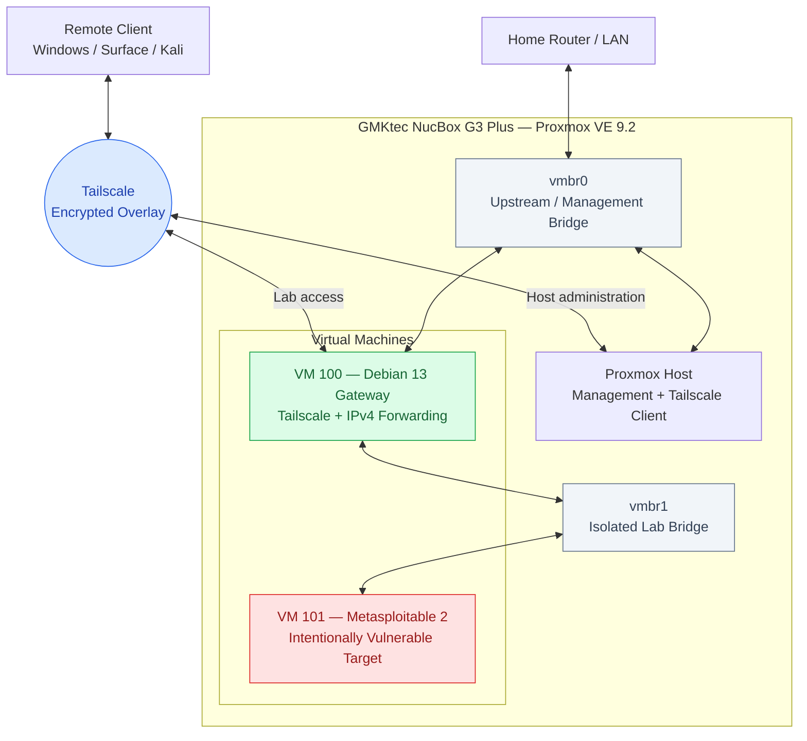

# Network Architecture

```mermaid
flowchart TB
    Remote["Remote Client<br/>Windows / Surface / Kali"]
    TS(("Tailscale<br/>Encrypted Overlay"))

    Router["Home Router / LAN"]

    subgraph Host["GMKtec NucBox G3 Plus — Proxmox VE 9.2"]
        PVE["Proxmox Host<br/>Management + Tailscale Client"]
        B0["vmbr0<br/>Upstream / Management Bridge"]

        subgraph VMs["Virtual Machines"]
            GW["VM 100 — Debian 13 Gateway<br/>Tailscale + IPv4 Forwarding"]
            MS["VM 101 — Metasploitable 2<br/>Intentionally Vulnerable Target"]
        end

        B1["vmbr1<br/>Isolated Lab Bridge"]
    end

    Remote <--> TS
    TS <-->|Host administration| PVE
    TS <-->|Lab access| GW
    Router <--> B0
    B0 <--> PVE
    B0 <--> GW
    GW <--> B1
    B1 <--> MS

    classDef overlay fill:#dbeafe,stroke:#2563eb,color:#1e40af
    classDef gateway fill:#dcfce7,stroke:#16a34a,color:#166534
    classDef vulnerable fill:#fee2e2,stroke:#dc2626,color:#991b1b
    classDef bridge fill:#f1f5f9,stroke:#64748b,color:#334155

    class TS overlay
    class GW gateway
    class MS vulnerable
    class B0,B1 bridge
```
  
